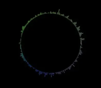

# jshe0589_9103_major-project

## Project Overview
This project utilizes audio to create interactive content with various functionalities and technical implementations.

### Interactive Features

#### Default State
- When the webpage opens, a default preset image animation will automatically play.
- The particles in the animation will shrink over time and eventually disappear.

#### Play Music
- Audio files have been added, allowing users to start or pause the music.
- An audio signal waveform circle surrounds the audio, changing with the amplitude of the sound.

#### Camera Capture
- With user permission, it can capture the user's current image after 3 seconds and use it as the color source for particles.
- Users can also choose to return to the default page.

### Inspirations

#### Inspiration One
Description of the first inspiration.

#### Inspiration Two
Inspired by a quote from Carl Sagan's "Pale Blue Dot":

> "On that distant point all the people you love all the people you know all the people you've ever heard of every human being who ever was lived out their lives... In the vast universe Earth is just a tiny speck of dust floating in a vast cosmic sea."

### Technical Details

#### Camera Capture Functionality
Referenced this video for implementing the camera capture feature:
[How to capture images using webcam](https://www.youtube.com/watch?v=G3WxVV7aN4I)

#### Audio Import
Found an example of importing audio on the p5.js website:
[Sound Effect Example](https://p5js.org/examples/sound-sound-effect.html)

#### Spectrum Visualization
Referenced this video for implementing the spectrum visualization:
[How to create a sound spectrum](https://www.youtube.com/watch?v=2O3nm0Nvbi4)

## Improvements Over Group Code

- **Increased Number and Size of Particles**: Enhanced visual effects.
- **Added Music Play and Pause Functionality**: Improved interactivity.
- **Introduced FFT Analysis and Sound Spectrum-based Rectangle Drawing**: Made the animation more dynamic.
- **Optimized Particle Initialization Process**: Ensured old particle arrays are cleared and new particles are regenerated.
- **Created Button Function**: Extracted button creation into the `createButtonUI()` function to avoid code repetition.
- **Simplified Particle Initialization**: Extracted particle initialization into the `initParticles()` function and simplified conditional checks.
- **Optimized Particle Class**: Kept the `move()` and `show()` methods in the particle class simple for better readability and maintenance.
- **Refactored Rectangle Drawing**: Extracted rectangle drawing into the `drawRectangles()` function to make the `draw()` function more concise.

These improvements not only made the code more readable but also enhanced maintainability.